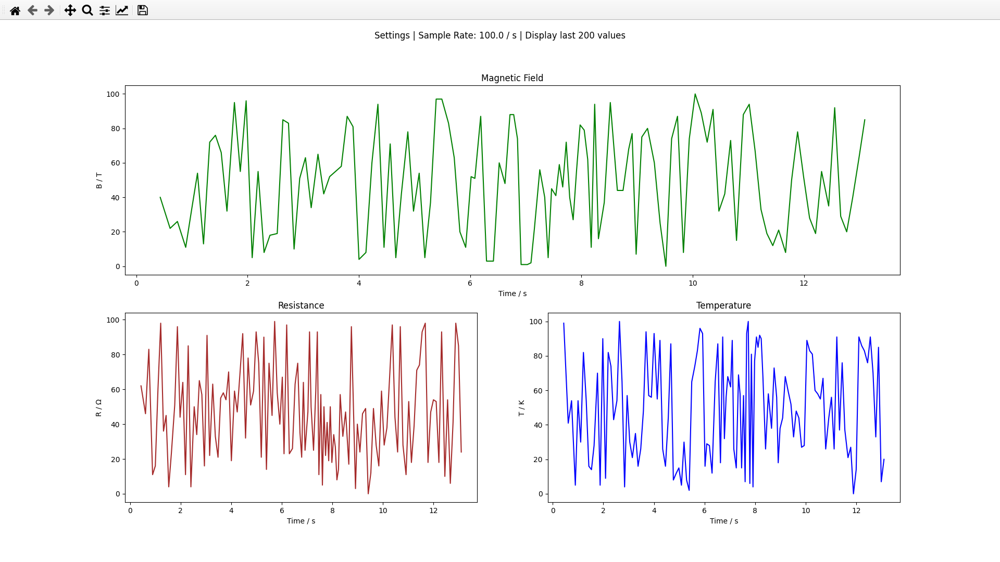
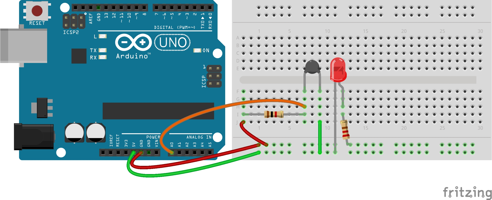
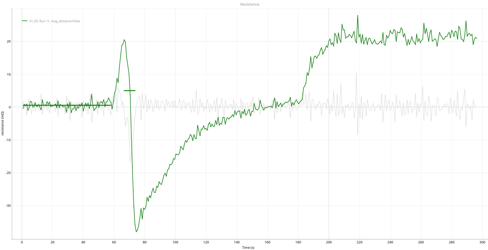

# The electrical resistance of a superconductor as a function of temperature

| Variable      | Device |
| ----------- | ----------- |
| Magnetic field      | MAGSYS HGM09s Gaussmeter      |
| Temperature   | P0K1.232.4SW.B.010 Cryogenic Temperature sensor        |






### Analysis

```
data/resistance/31_05_resistance_Run11.csv
green

Average 77K Resistance: 0.000541249136393919 Ω
Peak duration: 7.84003472328186 seconds
```

