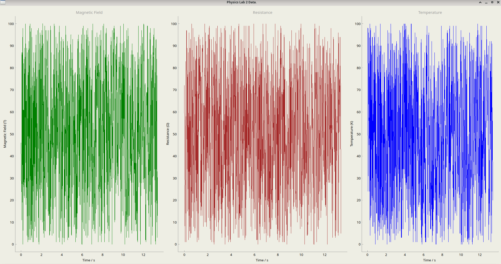

# The electrical resistance of a superconductor as a function of temperature

| Variable      | Device |
| ----------- | ----------- |
| Magnetic field      | MAGSYS HGM09s Gaussmeter      |
| Temperature   | P0K1.232.4SW.B.010 Cryogenic Temperature sensor        |

